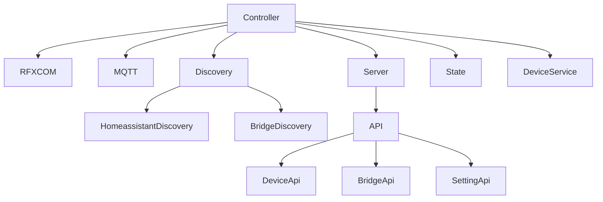

# RFXCOM2MQTT

[](http://www.rfxcom.com)

RFXCOM to MQTT bridge for RFXtrx433 devices

## Vue d'ensemble

rfxcom2mqtt est un pont entre les appareils RFXCOM (RFXtrx433) et MQTT. Il publie les événements RFXCOM sur des topics MQTT et prend également en charge l'intégration avec Home Assistant via la découverte MQTT.

Tous les événements RFXCOM reçus sont publiés sur le topic MQTT rfxcom2mqtt/devices/\<id\>. 
C'est au récepteur MQTT de filtrer ces messages ou d'avoir un mécanisme d'enregistrement/apprentissage/appairage.

## Architecture du projet

Le projet est structuré en plusieurs modules interagissant :



### Composants principaux

1. **Controller** : Classe principale qui coordonne tous les composants
2. **RFXCOM** : Gère la communication avec les appareils RFXtrx433
3. **MQTT** : Gère la communication avec le broker MQTT
4. **Discovery** : Gère la découverte des appareils et l'intégration avec Home Assistant
5. **Server** : Gère l'interface web
6. **State** : Gère l'état des appareils et des entités
7. **DeviceService** : Gère les appareils RFXCOM

## Fonctionnalités principales

### 1. Communication avec les appareils RFXCOM

Le module RFXCOM (src/rfxcom/index.ts) est responsable de la communication avec les appareils RFXtrx433. Il :

- Initialise la connexion avec l'appareil RFXCOM via le port USB configuré
- Gère les protocoles RFXCOM (activation, écoute d'événements)
- Traite les commandes reçues via MQTT et les envoie aux appareils RFXCOM
- Gère les événements de statut et de déconnexion
- Fournit des méthodes pour envoyer des commandes spécifiques (comme RFY pour les volets roulants)

### 2. Communication MQTT

Le module MQTT (src/mqtt/index.ts) gère la communication avec le broker MQTT. Il :

- Établit une connexion avec le broker MQTT configuré
- Gère les topics MQTT (base, devices, will, info)
- Publie des messages sur les topics MQTT
- S'abonne aux topics MQTT et transmet les messages reçus aux écouteurs
- Gère l'état de la connexion (en ligne/hors ligne)

### 3. Découverte des appareils

Le module Discovery (src/discovery/index.ts) gère la découverte des appareils et l'intégration avec Home Assistant. Il coordonne deux types de découverte :

- **HomeassistantDiscovery** : pour découvrir les appareils RFXCOM dans Home Assistant
- **BridgeDiscovery** : pour découvrir le pont RFXCOM dans Home Assistant

### 4. Interface web et API

Le module Server (src/server/index.ts) gère l'interface web du projet. Il :

- Configure un serveur Express pour l'interface web
- Gère l'authentification si un token est configuré
- Configure HTTPS si des certificats SSL sont fournis
- Sert le contenu frontend (interface utilisateur)
- Configure les routes API
- Initialise le service WebSocket pour les communications en temps réel

## Usage


### [Intégration Home Assistant](./docs/usage/integrations/home_assistant.md)

La façon la plus simple d'intégrer Rfxcom2MQTT avec Home Assistant est d'utiliser [MQTT discovery](https://www.home-assistant.io/integrations/mqtt#mqtt-discovery).
Cela permet à Rfxcom2MQTT d'ajouter automatiquement des appareils à Home Assistant.

### Configuration

Voir l'exemple **config.yml**

### Liste des commandes disponibles

[DeviceCommands](https://github.com/rfxcom/node-rfxcom/blob/master/DeviceCommands.md)

### [Topics MQTT et Messages](./docs/usage/mqtt_topics_and_messages.md)

### Intégration Somfy RFY

#### Configuration Home Assistant

Ajoutez ces lignes au fichier /hass-config/configuration.yaml.

``` YML
mqtt:
  cover:
    - name: "BSO Volet"
      command_topic: "rfxcom2mqtt/command/rfy/0x0B0003,0x020405,0x000006,0x000007"
      state_topic: "rfxcom2mqtt/command/rfy/0x0B0003,0x020405,0x000006,0x000007"
      availability:
        - topic: "rfxcom2mqtt/bridge/status"
      qos: 0
      retain: false
      payload_open: '{ "command": "up" }'
      payload_close: '{ "command": "down" }'
      payload_stop: '{ "command": "stop" }'
      state_open: "open"
      state_opening: "opening"
      state_closed: "closed"
      state_closing: "closing"
      payload_available: "online"
      payload_not_available: "offline"
      optimistic: false
      value_template: "{{ value.x }}"
      
    - name: "Salle de jeux Volet"
      command_topic: "rfxcom2mqtt/command/rfy/0x000002"
      state_topic: "rfxcom2mqtt/command/rfy/0x000002"
      availability:
        - topic: "rfxcom2mqtt/bridge/status"
      qos: 0
      retain: false
      payload_open: '{ "command": "up" }'
      payload_close: '{ "command": "down" }'
      payload_stop: '{ "command": "stop" }'
      state_open: "open"
      state_opening: "opening"
      state_closed: "closed"
      state_closing: "closing"
      payload_available: "online"
      payload_not_available: "offline"
      optimistic: false
      value_template: "{{ value.x }}"
```

#### Déclencheur MQTT [[MQTT explorer]](https://mqtt-explorer.com/)

##### Topics MQTT

* Topic par nom : rfxcom2mqtt/command/rfy/Mezanine3
* Topic par id : rfxcom2mqtt/command/rfy/0x000003
* Topic par liste d'ids : rfxcom2mqtt/command/rfy/0x000001,0x000002,0x000003

##### Corps MQTT

``` MQTT
{
  "command": "up"
}
```

##### Commandes MQTT

* up
* down
* stop
* program

#### Configuration rfxcom2mqtt (optionnel)

``` YML
devices:
  - id: '0x000003'
    name: 'Mezzanine3'
    friendlyName: 'Mezzanine 3'
    type: 'rfy' 
    subtype: 'RFY'
    blindsMode: 'EU'
```

### Healthcheck

Si le healthcheck est activé dans la configuration, le statut rfxcom sera vérifié toutes les minutes.
En cas d'erreur, le processus node se terminera.
Si installé dans docker, le conteneur essaiera de redémarrer et de se reconnecter à l'appareil RFXCOM.

## Modèles de données

Le module models (src/models/models.ts) définit les modèles de données utilisés dans le projet. Voici les principales classes :

1. **Action** : représente une action à exécuter sur un appareil ou le pont
2. **DeviceEntity** : classe de base pour les entités d'appareil
3. **DeviceState** : représente l'état d'un appareil
4. **DeviceStateStore** : gère l'état d'un appareil et fournit des méthodes pour le manipuler
5. **DeviceSensor, DeviceBinarySensor, DeviceSwitch, DeviceCover, DeviceSelect** : représentent différents types d'entités d'appareil
6. **BridgeInfo** : représente les informations sur le pont RFXCOM

## Configuration

La configuration du projet est définie dans un fichier YAML (config.yml). Voici les principales sections :

1. **loglevel** : niveau de journalisation (info, debug, warn, error)
2. **healthcheck** : configuration pour vérifier le statut RFXCOM
3. **cacheState** : configuration pour sauvegarder l'état des appareils
4. **homeassistant** : configuration pour l'intégration avec Home Assistant
5. **mqtt** : configuration pour la connexion MQTT
6. **rfxcom** : configuration pour la connexion RFXCOM
7. **devices** : liste des appareils avec leurs IDs, noms et types
8. **frontend** : configuration pour l'interface web

## Dépendances

La bibliothèque [RFXCOM](https://github.com/rfxcom/node-rfxcom) Node pour la communication avec le [RFXCOM](http://www.rfxcom.com) RFXtrx433 433.92MHz Transceiver.

La bibliothèque [MQTT.js](https://github.com/mqttjs/MQTT.js) pour l'envoi et la réception de messages MQTT.

Autres dépendances principales :
- **express** : framework web pour l'interface utilisateur
- **socket.io** : bibliothèque pour les communications WebSocket
- **winston** : bibliothèque pour la journalisation
- **js-yaml** : bibliothèque pour la gestion des fichiers YAML

## Développement

``` Node
nvm install 18.18
nvm use 18.18
npm install

npm install -g typescript
npm install -g ts-node

ts-node .\src\index.ts
```

### Construction d'une image Docker

Construction d'une image locale

```
docker-compose build
```

Construction d'une image multi-architecture

```
docker buildx build \ 
--platform linux/amd64,linux/arm/v7 \
--push \
-t rfxcom2mqtt/rfxcom2mqtt .
